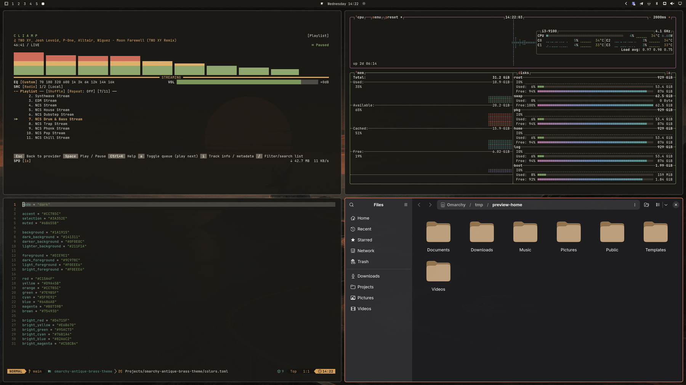

# Omarchy Antique Brass Theme

A warm, low-contrast dark theme for [Omarchy](https://omarchy.org):
coral accents on warm near-black, with cream text and muted earth-tone
ANSI colors. The theme is named for its signature accent, the Antique
Brass coral `#CC785C`.




## Install

```bash
omarchy theme install https://github.com/photuris/omarchy-antique-brass-theme
```

## Palette

| Role               | Hex       |
| ------------------ | --------- |
| Background         | `#1A1915` |
| Dark background    | `#141311` |
| Darker background  | `#0F0E0C` |
| Lighter background | `#211F1A` |
| Foreground         | `#ECE9E1` |
| Accent             | `#CC785C` |
| Selection          | `#3A352E` |
| Muted              | `#6B655B` |

Full ANSI palette in [`colors.toml`](colors.toml). Icons are
`Yaru-wartybrown-dark`; the keyboard RGB matches the accent.

The wallpaper is an original AI-generated render included under the
same license as the theme.
